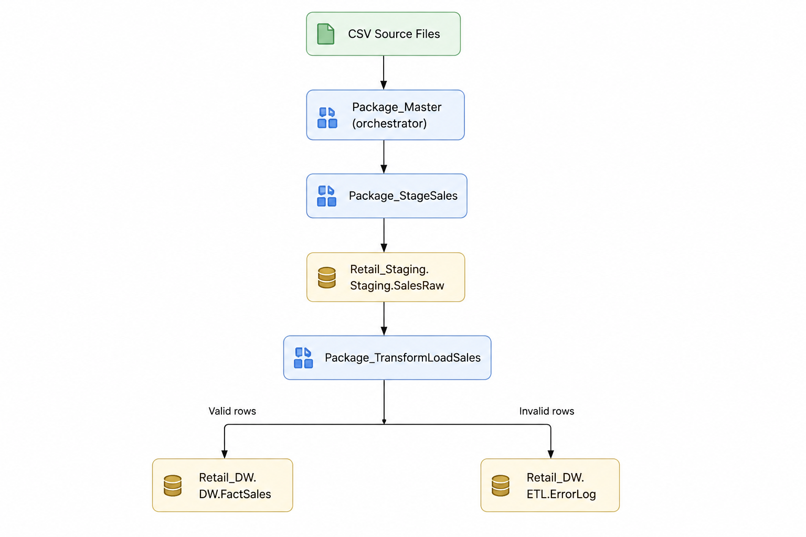
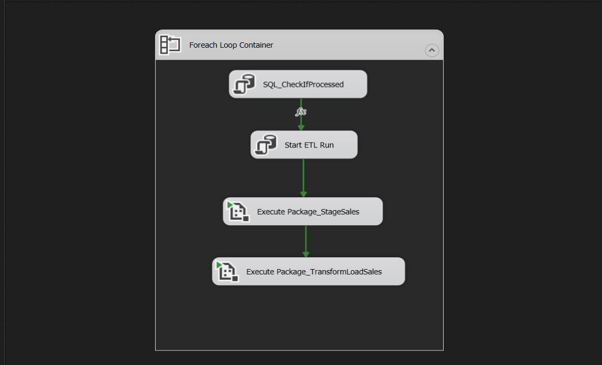
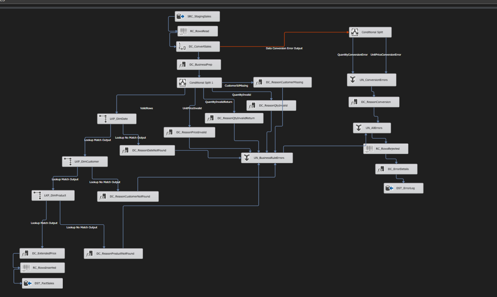

# Retail ETL — SSIS Data Warehouse Pipeline

An end-to-end ETL pipeline built in SQL Server Integration Services (SSIS) that loads raw retail sales CSV files into a validated, auditable star schema data warehouse — with per-file run tracking, granular error logging, true Type 2 slowly changing dimensions, and idempotent reruns.


## Table of Contents

- [Overview](#overview)
- [Architecture](#architecture)
- [Tech Stack](#tech-stack)
- [Prerequisites](#prerequisites)
- [Setup](#setup)
- [Project Structure](#project-structure)
- [Packages](#packages)
- [Validation Rules](#validation-rules)
- [Slowly Changing Dimensions](#slowly-changing-dimensions)
- [Database Schema](#database-schema)
- [Design Notes: The Dimension-Loading Race Condition](#design-notes-the-dimension-loading-race-condition)
- [Deployment](#deployment)
- [Known Limitations](#known-limitations--not-yet-implemented)

## Overview

```
CSV Source Files
       │
       ▼
Package_Master  (orchestrator)
       │
       ▼
Package_StageSales
       │
       ▼
Retail_Staging.Staging.SalesRaw
       │
       ▼
Package_TransformLoadSales
       │
       ├── Valid rows ─────► Retail_DW.DW.FactSales
       │
       └── Invalid rows ───► Retail_DW.ETL.ErrorLog
```

Each run processes one CSV file at a time, generates a unique `RunID`, and logs full audit information (row counts, status, timing) for that run. The pipeline is idempotent — re-running it skips any file already processed successfully, so it's safe to run repeatedly without creating duplicate data.



## Architecture

```
Package_Master
  └─ Foreach Loop Container (iterates every *.csv in the source folder)
       ├─ Check if file already processed (skip if so)
       ├─ Start ETL Run          → generates RunID, logs to ETL.AuditLog
       ├─ Execute Package_StageSales
       └─ Execute Package_TransformLoadSales
            ├─ EXEC ETL.usp_LoadDimCustomerSCD2   (Control Flow, runs to completion first)
            ├─ EXEC ETL.usp_LoadDimProduct        (Control Flow, runs to completion first)
            └─ Data Flow: validate → route errors → lookup dimension keys → load DW.FactSales
```

A single file's failure doesn't stop the batch — an `OnError` event handler marks that run as `Failed` in the audit log, and the loop continues to the next file.





## Tech Stack

- **SQL Server Integration Services (SSIS)** — ETL orchestration and data flow
- **T-SQL** — stored procedures for dimension loading (including a cursor-based SCD2 implementation)
- **SQL Server Agent** — production scheduling
- **SSISDB** — project deployment target

## Prerequisites

- SQL Server (2019+) with **Integration Services** installed
- **SQL Server Data Tools (SSDT)** or Visual Studio with the SSIS extension, for opening/editing the `.dtsx` packages
- **SQL Server Management Studio (SSMS)**
- An **SSISDB catalog** created on your target instance (for deployment)
- **SQL Server Agent** running, if you want scheduled execution

## Setup

1. **Clone the repo**
   ```bash
   git clone <https://github.com/AhmedAliAli811/UCI_Retail_SSIS.git>
   cd retail-etl-ssis
   ```

2. **Create the databases and schemas**
   Run the scripts in `/sql/schema/` in order:
   ```sql
   00_create_databasess.sql
   01_create_staging_tables.sql   -- Retail_Staging.Staging.SalesRaw
   02_create_dw_schema.sql        -- Retail_DW: DW.* ETL.*
   03_create_audit_error_tables.sql        -- Retail_DW: ETL.*
   04_populate_dimdate.sql        -- populate DW.DimDate for your data's date range
   ```  

3. **Create the dimension-loading stored procedures**
   ```sql
   /sql/procedures/LoadDimCustomer_Stored_procedure.sql
   /sql/procedures/LoadDimProduct_Stored_proceduret.sql
   ```

4. **Update the source folder path**
   Open `Package_Master.dtsx` in SSDT and point the Foreach Loop Container's folder to wherever your source CSVs live. (See [Known Limitations](#known-limitations--not-yet-implemented) — this is currently a hardcoded value, not yet parameterized.)

5. **Update connection managers**
   Point `CM_RetailStaging`, `CM_RetailDW`, and `FF_SourceSales` at your own server/instance.

6. **Run it**
   - From SSDT: right-click `Package_Master.dtsx` → Execute Package
   - Or deploy to SSISDB and run via SQL Agent (see [Deployment](#deployment))

## Project Structure

```
retail-etl-ssis/
├── Retail_SSIS/RetailDW/RetailDW/
│   ├── Package_Master.dtsx
│   ├── Package_StageSales.dtsx
│   └── Package_TransformLoadSales.dtsx
├── sql/
│   ├── schema/
│   │   ├── 00_create_databasess.sql
│   │   ├── 01_create_staging_tables.sql 
│   │   └── 02_create_dw_schema.sql
│   │   ├── 03_create_audit_error_tables.sql
│   │   └── 04_populate_dimdate.sql
│   └── procedures/
│       ├── LoadDimCustomer_Stored_procedure.sql
│       └── LoadDimProduct_Stored_proceduret.sql
├── source_data/          # sample CSV files (gitignored in practice for real data)
├── docs/           # screenshots referenced in this README
└── README.md
```

## Packages

### Package_Master
The orchestrator. Loops through every `.csv` file in the source folder using a Foreach Loop Container. For each file:
1. Checks `ETL.AuditLog` to see if this file was already processed successfully — if so, skips it
2. Starts a new ETL run (`Start ETL Run` task) — inserts an `ETL.AuditLog` row and generates a `RunID`
3. Calls `Package_StageSales`
4. Calls `Package_TransformLoadSales`

### Package_StageSales
Loads one CSV file, as-is, into `Staging.SalesRaw`, tagging every row with the current `RunID`. No validation or transformation happens here — this is a raw landing step.

### Package_TransformLoadSales
The core of the pipeline, in three phases:

**1. Dimension loading (stored procedures, run first in Control Flow)**
- `ETL.usp_LoadDimCustomerSCD2` — loads/updates `DW.DimCustomer`
- `ETL.usp_LoadDimProduct` — loads/updates `DW.DimProduct`

This ordering is deliberate — see [Design Notes](#design-notes-the-dimension-loading-race-condition) below.

**2. Validation and error routing (Data Flow)**
Each row is checked against business rules; failing rows are routed to `ETL.ErrorLog` with a specific reason.

**3. Fact loading (Data Flow)**
Valid rows are matched against `DimDate`, `DimCustomer`, and `DimProduct` (guaranteed to already exist, thanks to phase 1) and inserted into `DW.FactSales`.





## Validation Rules

| Rule | Error Reason |
|---|---|
| Quantity is not numeric | `QUANTITY_CONVERSION_ERROR` |
| UnitPrice is not numeric | `UNITPRICE_CONVERSION_ERROR` |
| CustomerID is missing/blank | `CUSTOMERID_MISSING` |
| Quantity ≤ 0 on a normal sale | `QUANTITY_INVALID` |
| Quantity ≥ 0 on a return (InvoiceNo starts with "C") | `QUANTITY_INVALID_RETURN` |
| UnitPrice is 0 after taking absolute value | `UNITPRICE_INVALID` |
| DateKey not found in DimDate | `DATE_NOT_FOUND` |

**Returns:** any `InvoiceNo` starting with `C` is treated as a cancellation/return, with negative `Quantity` expected rather than rejected. Returns share `DW.FactSales` with regular sales, distinguished by an `IsCancelled` flag — this keeps net sales/units calculations simple at query time while still allowing return-specific analysis.

**UnitPrice:** negative values are corrected to their absolute value rather than rejected (return line items can carry a negative unit price in the source data; the true price is always positive).

## Slowly Changing Dimensions

`DW.DimCustomer` is a true Type 2 SCD — when a customer's `Country` changes, the existing row is expired (`IsCurrent = 0`, `ExpiryDate` set) and a new row is inserted (`IsCurrent = 1`). Changes are keyed off each row's `InvoiceDate`, not the load date, since this pipeline processes historical data.

`usp_LoadDimCustomerSCD2` correctly handles a customer changing country **more than once within the same file** — changes are collapsed and applied strictly in chronological order per customer, one at a time, via a cursor. See [Design Notes](#design-notes-the-dimension-loading-race-condition) for why this couldn't be done as a simple set-based Lookup.

`DW.DimProduct` does not currently track history — it's insert-only for new `StockCode` values.

## Database Schema


```sql
DW.DimCustomer   (CustomerKey PK, CustomerID, Country, EffectiveDate, ExpiryDate, IsCurrent)
DW.DimProduct    (ProductKey PK, StockCode, CleansedDescription)
DW.DimDate       (DateKey PK [YYYYMMDD int], FullDate, Year, Quarter, Month, MonthName, Day, DayOfWeekNumber)
DW.FactSales     (SalesKey PK, DateKey FK, CustomerKey FK, ProductKey FK,
                   InvoiceNo, Quantity, UnitPrice, ExtendedPrice, IsCancelled)

ETL.AuditLog     (RunID PK, PackageName, FileName, StartTime, EndTime,
                   RowsRead, RowsInserted, RowsRejected, Status, ErrorMessage)
ETL.ErrorLog     (ErrorLogKey PK, RunID FK, PackageName, ErrorDate,
                   InvoiceNo, StockCode, Description, Quantity, InvoiceDate,
                   UnitPrice, CustomerID, Country, ErrorReason)

Staging.SalesRaw (InvoiceNo, StockCode, Description, Quantity, InvoiceDate,
                   UnitPrice, CustomerID, Country, RunID)
```

## Design Notes: The Dimension-Loading Race Condition

An early version of this pipeline loaded dimensions inline, using a Lookup → Conditional Split → OLE DB Command ("insert if not found") pattern directly inside the fact-loading Data Flow. This produced heavy duplicate rows in `DimCustomer` and `DimProduct` — the same customer inserted dozens of times.

**Root cause:** SSIS Data Flow processes rows in buffers, not one at a time start-to-finish. If many rows for the same new customer arrive in the same buffer, they all reach the "does this exist?" Lookup before any of them has reached the Insert step further downstream — so all of them correctly (but unhelpfully) see "not found," and all of them attempt to insert.

This is **not** a classic multi-transaction race condition, and transaction isolation levels (including `SERIALIZABLE`) don't fix it — there's no second transaction to isolate from; it's all one Data Flow with rows in flight concurrently.

**Fix:** dimension loading was moved out of the fact Data Flow entirely, into its own Control Flow step (stored procedures called via Execute SQL Task) that runs to **full completion** before the fact-loading Data Flow begins. Control Flow precedence constraints guarantee sequential completion in a way Data Flow branches cannot.

A second, subtler version of the same problem appeared once SCD Type 2 was introduced: multiple changes to the same customer *within a single file* still needed strict chronological ordering, which even an isolated dimension-loading step couldn't guarantee on its own (rows for that customer still arrive concurrently). This required a genuinely sequential, cursor-based approach inside the stored procedure itself — sorting all changes per customer chronologically and applying them one at a time.

## Deployment

Deployed to SSISDB and scheduled via a SQL Server Agent job (`Retail ETL - Daily Load`), running `Package_Master.dtsx` on a daily schedule.

To deploy:
1. Build the project in SSDT (produces an `.ispac` file)
2. Right-click the project → **Deploy** → follow the Integration Services Deployment Wizard into your SSISDB catalog
3. In SSMS, create a SQL Agent job with a **SQL Server Integration Services Package** step pointing at the deployed `Package_Master.dtsx`
4. Set a schedule


## Known Limitations / Not Yet Implemented

- **File paths are hardcoded** rather than parameterized via SSISDB environment variables. A `SourceFolderPath` project parameter exists but isn't currently wired into the Foreach Loop or connection manager.
- **No failure alerting** — failed runs are logged (`ETL.AuditLog.Status = 'Failed'`) but no email/notification is sent.
- **No SCD tracking on DimProduct** — if a product's description changes, the existing row is simply left as-is (no history).
- **No cleanup of orphaned partial data** after a failed run — a failed file's partial rows in `Staging.SalesRaw` / `DW.FactSales` aren't automatically purged before a retry.
- **Product description truncation is silent** — `DimProduct.CleansedDescription` is `NVARCHAR(30)`; longer source descriptions are truncated by SQL Server without being logged.
